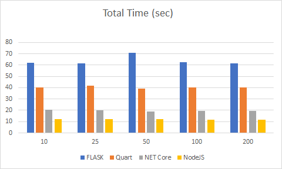
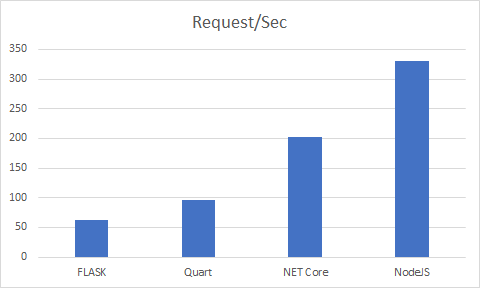

## Comparing microservices built on Python, NodeJS and ASPNet Core

Microservices are a software development technique  that arranges an application as a collection of loosely coupled services. In a microservices architecture, services are fine-grained and the protocols are lightweight.

MongoDB is the market leader in NOSQL databases. Is a document-oriented database and uses JSON-like documents. In these tests, I will use the basic MongoDB driver, so I will don't worry about schemas or other layers.
Have you ever wondered how the main languages ​​for creating microservices with MongoDB behave?

I built three equal microservices, they consist of extracting a data set from a Mongo base and looking at the performance

### Some assumptions:
1. The three services were built on Windows system.
2. They were designed to open a single connection and avoid delays in the process of opening and closing connections and different ways of using connection pools.
3. A local MongoDB base is used to avoid disparate results due to network delays.
4. The Apache Bench port for Windows is used to measure performance.
5. No index is used in the Mongo base. The base is not large and I want to try to simulate the delay that occurs when searching records on larger databases.
6. The MongoDB URI, database and collection are set in environment variables.
7. I will assume that the base is always operational and connected. To avoid large error handling and try..catch blocks. So error handling will be quite light

### The system

* Intel Core I7-5557 CPU 3.1 GHz, 16 GB RAM, Super Talent TeraDrive CT 240 GB 2.5 SSD
* MongoDB 3.6 for Windows
* Vistual Studio 2019 and Visual Studio Code 1.41
* Python v3.7.5
* NET Core v3.0
* NodeJS v11.4.0

### The frameworks

#### NodeJS
It will use the Express web framework. 

#### Python
I made the test using two flavors: Flask (with Waitress) and Quart (with Hypercorn). Some blogs report Quart has the best performance, so I will test it

#### Net Core. 
Net Core is the portable version of .NET. It will use IIS Express

### The test

Each microservice is an API Rest service. The base is a list of 1460 technology companies. The proof consists in obtaining from the base a list of companies whose number of employees is greater than 20. Then in the service (not in the base), the result will be truncated to a maximum of 100 companies.
The test are 4000 requests using 10,25,50,100 and 200 simultaneous requests

### The results

Time in seconds. Lower is better.
|Parallel Request|Flask|Quart|NET Core|NodeJs|
-----|-----|-----|-----|-----|-----|-----|
10|	62|40|20|12|
25|	61|42|20|12|
50|	71|39|19|12|
100|63|40|20|12|
200|62|40|20|12|




Requests by seconds. Higher is better

|Request/Sec|Flask|Quart|NET Core|NodeJs|
-----|-----|-----|-----|-----|
||62,964|95,514|202,582|330,378|





### Conclusions

Node is the easiest language for it. Showed the best performance without any tunning. If you know javascript and you have a very lightweight code, NodeJS is the perfect choice. Otherwise, you will have to deal with promises, async/await cascade code and other problematic aspects and the code will be a nightmare. Read this: https://blog.codeship.com/node-js-async-best-practices-avoiding-callback-hell. Also, there are plenty of libraries out there, but not all of them are stable or well maintained. So, be careful.

Python has the better and stable libraries. But showed the worst performance. If you don't care about it and you are new on programming, Python is the choice.

NET Core has good performance, but lack a good programmer oriented environment for using MongoDB. 

In this example:

Mongo Shell:
```
db.companies.find({numEmps: {$gt:20} })
```

NodeJS: 
```
collection.find({ numEmps: {$gt: 20} })

````

Python:
```
collection.find({"numEmps":{"$gt":20}})
```

But NET Core:
```
var filter = Builders<BsonDocument>.Filter.Gt("numEmps", 20);
var documents = collection.Find(filter).ToList<BsonDocument>();
```

Python and Node have almost the same syntaxis as MongoDB Shell. So you can test your queries at runtime. But NET Core uses his own syntaxis for MongoDB, Why?... Why would you prefer to use LinQ? so, besides learn the MongoDB operator, you must learn the .NET Core operators for using it. Also, you must compile the code. All of this takes time. 
NET Core showed the best performance behind NodeJS, but it's lack many open source libraries and the support for them is bad. If you already have NET codebase with your own libraries, NET Core is the best option.


